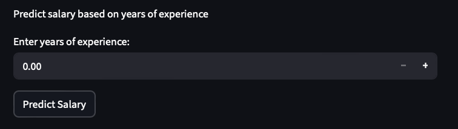
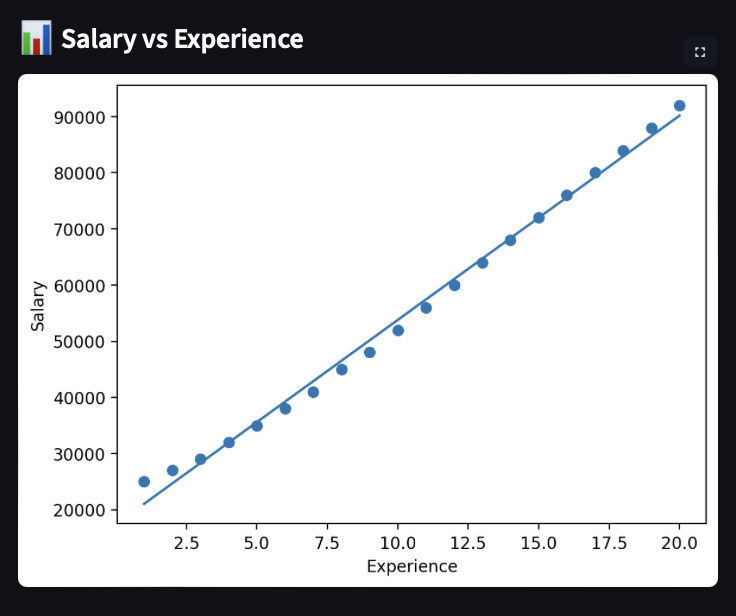

# Salary Predictor App

## Overview

This is a Machine Learning web application that predicts employee salary based on years of experience.

The app is built using Python, Pandas, Scikit-learn, and Streamlit, and provides an interactive interface for users to input data and receive real-time predictions.

---

## Features

* Input years of experience
* Predict salary using Linear Regression
* Visualise data with a chart
* Clean and interactive UI

---

## Tech Stack

* Python
* Pandas
* Scikit-learn
* Streamlit
* Matplotlib

---

## How to Run Locally

1. Clone the repository:

```
git clone https://github.com/YOUR_USERNAME/salary-predictor-app.git
```

2. Navigate into the folder:

```
cd salary-predictor-app
```

3. Install dependencies:

```
pip install -r requirements.txt
```

4. Run the app:

```
streamlit run app.py
```

---

## Screenshot





---

## What I Learned

* How to build a machine learning model using data
* How to use Pandas for data analysis
* How to deploy an interactive app using Streamlit
* How to structure a project for GitHub

---

## Future Improvements

* Add more features (e.g. role, location)
* Improve model accuracy
* Deploy the app online

---
